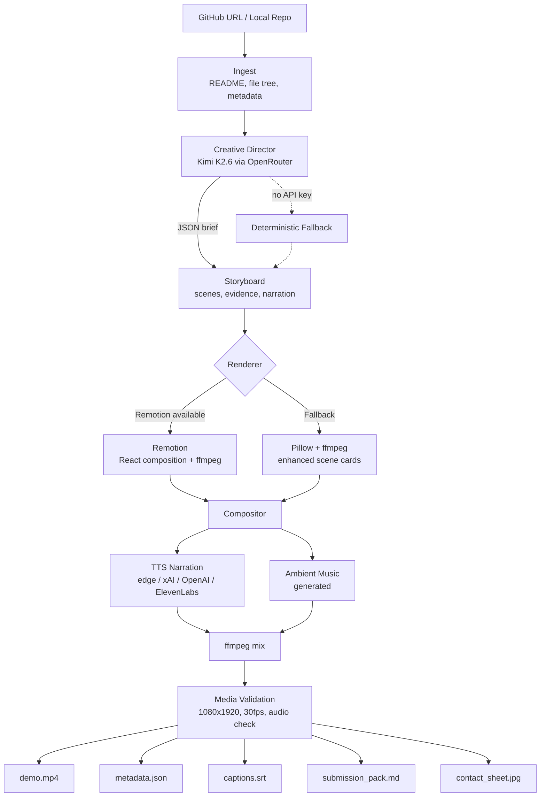
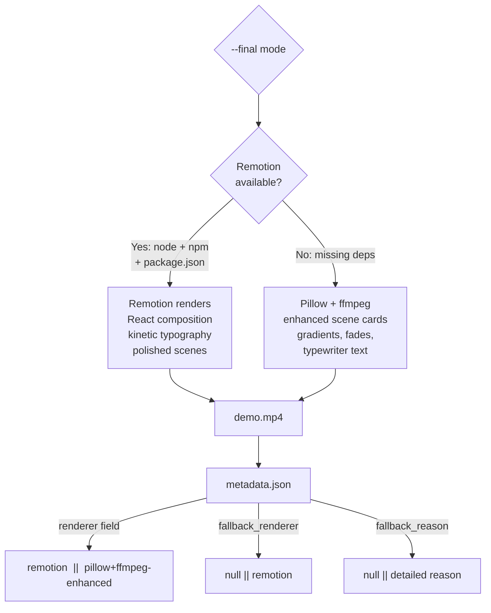

# Repo-to-Shorts Agent

Turn any GitHub repo into a 60-second animated creative short. Built for the Nous Research Hermes Agent Creative Hackathon.

**The meta pitch:** The demo video is a screen recording of this app generating a video of itself.

## Quick start

```bash
# Install
python3.13 -m venv .venv
.venv/bin/python -m pip install --upgrade pip
.venv/bin/python -m pip install -e '.[dev,render]'

# Optional: set OPENROUTER_API_KEY in your shell for live Kimi.
# Without it, the pipeline records deterministic fallback mode.

# Generate a creative short
.venv/bin/repo-shorts creative https://github.com/owner/repo --final

# Or use the web UI
.venv/bin/repo-shorts web
```

Requires system `ffmpeg` and `ffprobe`. For Remotion rendering, also needs Node.js and npm.

## How it works

1. **Paste a GitHub URL** into the web UI at `http://127.0.0.1:8765`, or pass it via CLI
2. **Ingest** reads README, file tree, package metadata, and git log from the target repo
3. **Kimi K2.6 (Creative Director)** analyzes repo context via OpenRouter and designs a creative brief: visual style, scene breakdown, narration script, pacing
4. **Renderer** animates the scenes at 1080×1920 — Remotion (React + ffmpeg) when Node.js is available, Pillow + ffmpeg as honest fallback
5. **Compositor** generates optional TTS narration, ambient music, and mixes audio into the final MP4
6. **Media validation** verifies resolution, duration, and audio streams before declaring success
7. **Output:** `demo.mp4`, `metadata.json` (live Kimi proof), `captions.srt`, `submission_pack.md`, and production QA manifests

All of this runs from one browser click, one Hermes Agent command, or one CLI invocation.

## Architecture



**Outer loop:** Hermes Agent reads the `repo-shorts-creative` skill, invokes the CLI, and validates `kimi.mode=live-api` in metadata before declaring success. **Inner loop:** the Python pipeline. Hermes orchestrates; the CLI executes; Kimi directs.

## CLI

The web UI wraps the same engine. CLI for scripting, Hermes integration, and CI:

```bash
# Creative short — full pipeline with Kimi direction, rendering, TTS, and audio
repo-shorts creative https://github.com/owner/repo --final

# Preview mode — fast 12-15s render for iteration
repo-shorts creative . --preview --skip-audio

# Preview comparison — generate and score multiple concept variants
repo-shorts creative . --preview --compare-previews

# Full final export with TTS
repo-shorts creative . --final --tts-provider xai --fallback-tts-provider openai

# Classic analysis — artifact package with Kimi critic pass
repo-shorts analyze https://github.com/owner/repo --out runs

# With live Kimi and MP4
OPENROUTER_API_KEY="***" repo-shorts creative . \
  --audience "hackathon judges" \
  --kimi-model moonshotai/kimi-k2.6 \
  --tts-provider xai \
  --fallback-tts-provider openai \
  --out runs \
  --final
```

**Key flags:**

| Flag | Description |
|---|---|
| `--final` | Full 45-60s creative short with 5-8 scenes, media validation enforced |
| `--kimi-model` | OpenRouter model name (default: `moonshotai/kimi-k2.6`) |
| `--tts-provider` | TTS provider: `edge`, `xai`, `openai`, `elevenlabs`, or `none` |
| `--fallback-tts-provider` | Fallback if primary TTS fails |
| `--out` | Output directory (default: `runs`) |
| `--audience` | Audience string passed to Kimi for context |

## Web UI

```bash
repo-shorts web
```

Opens `http://127.0.0.1:8765` with a VHS broadcast aesthetic (CRT scanlines, SMPTE color bars, channel strips):

- Paste any GitHub URL or local path
- Toggle **Creative short** (animated + narrated) or **Classic analysis** (artifact package)
- Set audience, Kimi model, and render options
- Watch channel rows light up as the pipeline progresses through ingest → analyze → kimi_brief → render_frames → compose → finalize
- View the generated MP4 in a CRT viewport with scanline overlay
- Browse past runs in the tape archive

For LAN demo access:

```bash
repo-shorts web --host 0.0.0.0 --port 8765
```

## Hermes Agent skill

Repo-to-Shorts ships as a Hermes Agent skill at `.hermes/skill/SKILL.md`. Inside an interactive `hermes` REPL, the agent reads the skill, decides to invoke its terminal toolset, runs the underlying CLI, and validates the live Kimi proof in `metadata.json` before declaring success.

```
hermes
> /repo-shorts-creative https://github.com/owner/repo
```

Or in natural language: *"Make a launch short for this repo."*

The skill is the boundary. Hermes Agent is the agentic operator. Repo-to-Shorts is the workflow. Kimi K2.6 is both the model behind Hermes and the creative director inside the pipeline. Two layers of Kimi, one Hermes loop.

### Install the skill

```bash
mkdir -p ~/.hermes/skills/video/repo-shorts-creative
cp .hermes/skill/SKILL.md ~/.hermes/skills/video/repo-shorts-creative/SKILL.md
```

## Rendering

Repo-to-Shorts uses a dual-renderer architecture with honest fallback:



**Never claims Remotion if Pillow produced the file.** The renderer field in `metadata.json` records the honest truth. If Remotion failed or was unavailable, `fallback_renderer` and `fallback_reason` are recorded.

### Contact sheet

When ffmpeg is available, `scripts/run-local-final.sh` generates a sampled-frame contact sheet for quick visual QA:

```
ffmpeg -y -i demo.mp4 -vf "fps=1/7,scale=270:-1,tile=3x3" -frames:v 1 contact_sheet.jpg
```

## TTS and audio

Narration is generated per scene, mixed with ambient music, and merged into the final MP4.

**TTS providers:**

| Provider | Notes |
|---|---|
| `edge` | Microsoft Edge TTS (free, no key required) |
| `xai` | xAI TTS (requires `XAI_API_KEY`) |
| `openai` | OpenAI TTS (requires `OPENAI_API_KEY`) |
| `elevenlabs` | ElevenLabs TTS (requires `ELEVENLABS_API_KEY`) |
| `none` | Skip TTS/audio narration |

Use `--tts-provider` to choose the primary provider and `--fallback-tts-provider` to choose one fallback. `metadata.json` records `tts.actual_provider`. If the selected provider and fallback fail while narration is required, the pipeline exits with an error.

**Ambient music:** Generated programmatically per run. Duration matches total scene time. Can be replaced with a custom track via `--music path/to/track.mp3`.

Silence padding is inserted for scenes without narration to maintain timing alignment.

## Creative brief structure

Kimi K2.6 outputs a JSON brief. In `--final` mode, the schema uses the Remotion storyboard contract:

```json
{
  "schema_version": 1,
  "creative_direction": {
    "angle": "meta demo",
    "tone": "sharp, cinematic, builder-focused",
    "visual_style": "retro-futuristic editorial"
  },
  "storyboard": [
    {
      "type": "ColdOpen",
      "duration_seconds": 3,
      "headline": "This repo made the video you're watching.",
      "narration": "This repo made the video you're watching.",
      "evidence": ["repo_name"],
      "caption_emphasis": ["repo", "video"]
    }
  ],
  "quality_bar": {
    "avoid": ["generic architecture slide", "bottom caption box", "fake proof"],
    "must_show": ["live Kimi proof", "generated MP4", "repo evidence"]
  },
  "music_mood": "electronic",
  "total_duration": 45
}
```

**Scene types:** `ColdOpen`, `RepoEvidence`, `PainPoint`, `PipelineMap`, `ArtifactStack`, `LiveProof`, `DemoPreview`, `CTAEndCard`

**Visual styles:** `dark-terminal`, `clean-academic`, `playful`, `cinematic`

The parser is backward-compatible with the older `scenes`-based brief format (using `visual_tool` and `transition` fields).

## Generated artifacts

Each run creates `runs/<timestamp>-<repo>/`:

| Artifact | Description |
|---|---|
| `demo.mp4` | Final 1080×1920 creative short with audio |
| `metadata.json` | Kimi mode proof, render details, TTS provider, creative brief |
| `captions.srt` | Timestamped captions from narration |
| `submission_pack.md` | Command used, Kimi proof checklist, X/Discord drafts |
| `video_raw.mp4` | Video without audio (for remixing) |
| `manim_scene_descriptor.json` | Scene script fed to the renderer |
| `contact_sheet.jpg` | Sampled-frame grid for taste QA when generated by `scripts/run-local-final.sh` |
| `manim_frames/` | Individual rendered frames |
| `production/` | Taste and production manifests (see below) |

### Production manifests

Every creative run writes a `production/` directory with structured manifests:

| Manifest | Description |
|---|---|
| `production/design_profile.json` | Parsed DESIGN.md frontmatter (colors, typography, components) |
| `production/reference_pack.json` | Reference descriptors and anti-patterns from taste research |
| `production/evidence_manifest.json` | Repo evidence: name, description, safe key files, components |
| `production/creative_brief.json` | Kimi-generated brief with taste fields (visual_world, motion_principles, etc.) |
| `production/scene_plan.json` | Scene-by-scene storyboard output |
| `production/asset_manifest.json` | Generated assets inventory |
| `production/audio_plan.json` | TTS provider, music mode, skip/dolby/voiceover settings |
| `production/qa_report.json` | Deterministic taste QA score, blocking issues, and taste issues |

### Run modes

| Mode | Trigger | Behavior |
|---|---|---|
| **Deterministic package** | `repo-shorts analyze` | No video rendering; generates artifact package with Kimi critique |
| **Preview video** | `repo-shorts creative --preview` | Fast 12-15s render; relaxed validation; draft label on success page |
| **Final video** | `repo-shorts creative --final` | Full 45-60s creative short; strict media validation + taste QA enforced |
| **Preview comparison** | `repo-shorts creative --preview --compare-previews` | Generates 2-3 concept variants and scores them; picks the best |

The web UI toggles (SP/LP/EP) map to these modes. SP = preview silent, LP = preview with optional audio, EP = final export. The success page label changes from "PACKAGE COMPLETE" to "PREVIEW DRAFT" to "BROADCAST COMPLETE" (or "VALIDATION FAILED") based on `metadata.json` render state.

### Taste QA and revision loop

Before rendering, the pipeline runs a deterministic taste QA pass on the creative brief. This uses structured issue reporting (`defect`, `evidence`, `fix`) rather than vague "looks bad" feedback.

The QA checks for:
- **Blocking issues** (fail the run): weak hooks, missing CTA, no repo specificity
- **Taste issues** (warn, don't block): caption density, generic AI copy, layout repetition

When `--final` is enabled, failures feed a bounded revision loop that re-prompts Kimi with QA feedback (up to `--max-revisions`). If blocking issues remain after retries, the run fails with `qa_report.json` and `revision_history.json` preserved for inspection.

QA results are written to `production/qa_report.json` and may include a `preview_comparison` section when `--compare-previews` is used.

## Kimi usage and proof

Kimi K2.6 operates on two fronts:

1. **Hermes orchestration** — Kimi powers the Hermes harness as the reasoning model, configured in `~/.hermes/config.yaml`
2. **Creative director** — Kimi designs the creative brief inside the Repo-to-Shorts pipeline via OpenRouter

Both modes record honest metadata:

```json
"kimi": {
  "mode": "live-api",
  "model": "moonshotai/kimi-k2.6",
  "provider": "openrouter"
}
```

**Possible modes:**

| Mode | Meaning |
|---|---|
| `live-api` | OpenRouter call succeeded; brief is Kimi-generated |
| `deterministic-fallback` | No API key set; brief is templated |
| `api-error-fallback` | API call failed; `fallback_reason` recorded |

If no `OPENROUTER_API_KEY` is set, the tool uses a deterministic fallback. It still produces a video, but the brief is templated rather than Kimi-designed. `metadata.json` always records the truth.

## Metadata contract

A live Kimi run with MP4 rendering records:

```json
{
  "target": ".",
  "source_type": "local",
  "repo_name": "repo-to-shorts-agent",
  "creative_brief": {
    "style": "dark-terminal",
    "title": "The Camera Eats Its Own Lens",
    "hook": "This repo made the video you're watching.",
    "scenes": [...],
    "music_mood": "electronic",
    "total_duration": 60
  },
  "kimi": {
    "mode": "live-api",
    "model": "moonshotai/kimi-k2.6",
    "provider": "openrouter"
  },
  "tts": {
    "provider": "xai",
    "fallback_provider": "openai",
    "actual_provider": "xai"
  },
  "render": {
    "mode": "mp4",
    "renderer": "pillow+ffmpeg-enhanced",
    "scene_count": 5,
    "validation": {
      "ok": true,
      "resolution": "1080x1920",
      "duration_seconds": 60.0,
      "has_audio": true
    }
  }
}
```

When Remotion renders: `renderer` is `remotion`. When Pillow renders: `renderer` is `pillow+ffmpeg-enhanced`. Never claimed falsely.

## Install

```bash
python3.13 -m venv .venv
.venv/bin/python -m pip install --upgrade pip
.venv/bin/python -m pip install -e '.[dev,render]'
```

Requires system `ffmpeg` and `ffprobe`. Render extra (`.[render]`) pulls in Pillow.

For Remotion rendering, additionally install Node.js dependencies:

```bash
npm install
```

## Development

```bash
.venv/bin/python -m pytest -q        # 170 tests
.venv/bin/ruff check .               # lint
.venv/bin/repo-shorts web            # start UI
```

## Hackathon submission

The submission is a split-track screen recording: Hermes terminal on the left invoking `/repo-shorts-creative`, VHS browser UI on the right showing channel rows lighting up as the pipeline runs. The generated `demo.mp4` plays in the closing beat.

Detailed submission materials live in `docs/submission/`:

- `x-post-variants.md` — five X tweet drafts tagging `@NousResearch` and `@Kimi_Moonshot`
- `discord-post.md` — Discord submission post for the `creative-hackathon-submissions` channel
- `demo-shot-list.md` — 60-second recording shot list with per-beat timestamps

**Proof points:**
1. Hermes REPL reads the skill and invokes the CLI
2. Terminal and browser show the pipeline running in parallel
3. `metadata.json` proves `kimi.mode: live-api`
4. Generated `demo.mp4` is the meta artifact
5. `submission_pack.md` references the skill path

See `docs/submission-checklist.md` for the full pre-deadline runbook.
